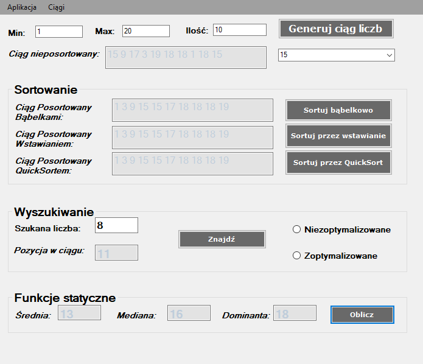

# Statistical-application
> This is a simple statistical application written in c# as an assignment for my university

## Table of Contents
* [General Info](#general-information)
* [Technologies Used](#technologies-used)
* [Features](#features)
* [Screenshots](#screenshots)
* [Setup](#setup)
* [Usage](#usage)
* [Project Status](#project-status)
* [Room for Improvement](#room-for-improvement)
* [Acknowledgements](#acknowledgements)
* [Contact](#contact)
<!-- * [License](#license) -->

## General Information
  This is a simple application, which allows users to generate a series of numbers and calculate
  some of it's statistical functions, as well as find the position of any number in that series.

## Technologies Used
- C# 7.3
- Visual Studio 2019
- .NET Framework 4.8

## Features
List the ready features here:
- Generating a number series of set lenght
- 3 types of number sorting
- Locating the position of any number number in the series
- Calculating the average
- Calculating the median
- Calculating the dominant

## Screenshots

## Setup

## Project Status
Project is: _in progress_ / _complete_ / _no longer being worked on_. If you are no longer working on it, provide reasons why.

## Room for Improvement
Include areas you believe need improvement / could be improved. Also add TODOs for future development.

Room for improvement:
- Improvement to be done 1
- Improvement to be done 2

To do:
- Feature to be added 1
- Feature to be added 2

## Acknowledgements
Give credit here.
- This project was inspired by...
- This project was based on [this tutorial](https://www.example.com).
- Many thanks to...

## Contact
Created by [@flynerdpl](https://www.flynerd.pl/) - feel free to contact me!

<!-- Optional -->
<!-- ## License -->
<!-- This project is open source and available under the [... License](). -->

<!-- You don't have to include all sections - just the one's relevant to your project -->
